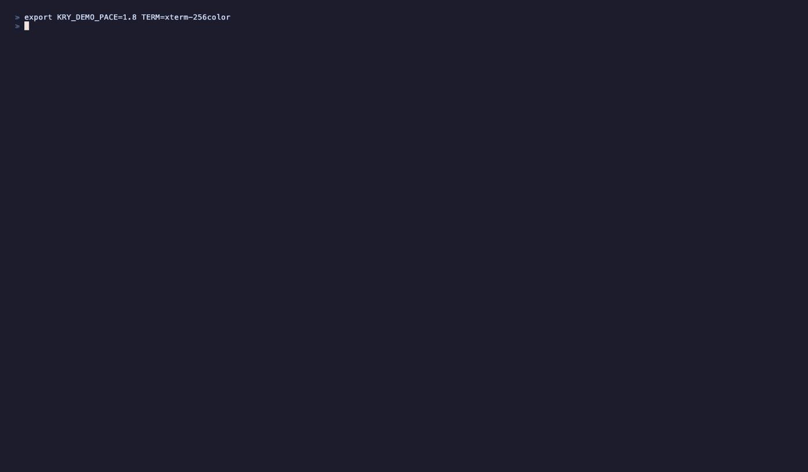

<div align="center">

# kry

[](https://github.com/thequantumfalcon/kry/actions/workflows/ci.yml)
[](https://github.com/thequantumfalcon/kry/actions/workflows/codeql.yml)
[](https://scorecard.dev/viewer/?uri=github.com/thequantumfalcon/kry)
[](LICENSE.md)
[](https://www.python.org/)

### don't trust your LLM savings dashboard. verify it. 🧾

**kry turns the usage logs you already have into a _stranger-verifiable_ proof that your caching & routing savings ledger is **intact and honestly priced** — cryptographically tamper-evident, recomputed against public pricing, with the trust you place in the operator made an explicit, machine-checked `veracity_floor`. It proves integrity, not that the savings happened (that's the floor's job). No prompts exposed, zero dependencies.**

`zero-dependency` · `pure Python stdlib` · `Python ≥ 3.11` · `stdlib suite green` · `readiness: research_grade`



<sub>The package actually running, start to finish — the proof is the attestation plus verifier, not the animation. Prefer text? Full transcript right below. 👇</sub>

<sub>💸😭 <em>your inference bill is about to cry.</em></sub>

</div>

<details>
<summary><b>📜 Full demo output — readable text</b> (a representative run, ANSI-stripped; produced by <code>bash examples/demo.sh</code>)</summary>

<br>

```text
  K R Y   —   Proof-of-Efficiency Compute Credit
  earn by provably avoiding inference cost · prove it to a stranger · stdlib only

━━━━━━ FULL LIFECYCLE  —  earn → mint → attest → STRANGER-verifies → carbon ━━━━━━
The whole loop, on real efficiency events, in one program:

──────────────────────────────────────────────────────────────────────
1. EARN — efficiency events become KRY (edge-weighted by what they avoided)
──────────────────────────────────────────────────────────────────────
  balance:            2,436.00 KRY
  lifetime earned:    2,436.00 KRY
  frontier basis: $25.0/M output tokens   (40,000 KRY / USD)

──────────────────────────────────────────────────────────────────────
2. RETAIN — the honest value TODAY (money kept, no counterparty needed)
──────────────────────────────────────────────────────────────────────
  retained_usd:                 $0.0609
  value_type:                   retained_dollars (money kept) — NOT a tradeable token
  external_counterparty_exists: False  (honest label)

──────────────────────────────────────────────────────────────────────
3. MINT — every earn is a SHA-256 hash-chain receipt (tamper-evident)
──────────────────────────────────────────────────────────────────────
  receipts:    3
  chain_tip:   eae1b80e8baedc1e...
  chain_valid: True
  veracity_floor: 0.3924  (fraction anchored by more than self-report — external OR operator-run)

──────────────────────────────────────────────────────────────────────
4. ATTEST — a public, content-sealed proof of the balance
──────────────────────────────────────────────────────────────────────
  wrote 3 links, total 2,436.00 KRY -> <tmpdir>/attestation.json
  (contains only hashes + aggregates — no prompts, responses, or model
   names beyond the event type; safe to hand to a third party)

──────────────────────────────────────────────────────────────────────
5. VERIFY — a STRANGER checks it with stdlib only (the differentiator)
──────────────────────────────────────────────────────────────────────
KRY external verification — attestation
  receipts:        3 (recomputed from links)
  total_kry:       2436.0 (recomputed from links, not the declared field)
  veracity_floor:  0.3924 (fraction anchored by more than self-report — external OR operator-run)
                   ↳ anchored tiers are chain-bound LABELS — run kry_tee_verify /
                     kry_tlsn_verify to independently check the underlying evidence doc
  price basis:     $25.0/M frontier, as of 2026-06-03 (magnitude recomputed from the public price table)
  anchor check:    NONE — ⚠ the anchored fraction is OPERATOR-ASSERTED
                   here: a genesis re-mint with upgraded tiers passes this check.
                   Re-run with --anchor <operator's pre-published chain head> to make
                   a retroactive re-mint detectable.
  VERDICT: VALID — integrity + conservation + magnitude (where checkable) hold; trust surface honest (read veracity_floor for what is operator-asserted).

──────────────────────────────────────────────────────────────────────
6. CARBON — second denomination: avoided inference -> CO2 (ESTIMATE)
──────────────────────────────────────────────────────────────────────
  kry_avoided:        2,436.00
  energy_kwh_avoided: 0.001353 kWh
  co2_grams_avoided:  0.5413 g
  status:             ESTIMATE — not a certified carbon credit (grid region unknowable: inference_geo redacted)

══════════════════════════════════════════════════════════════════════
Done. The balance was minted from real efficiency events, anchored in a
tamper-evident chain, and verified by a program that trusts nothing in
this package. That is what 'proof-of-efficiency' means in practice.
(temp data dir <tmpdir> — safe to delete)
══════════════════════════════════════════════════════════════════════

━━━━━━ OPERATOR VIEW  —  a real routing log → a verifiable savings statement ━━━━━━
SAVED vs SPEND + veracity_floor; --mint anchors it, --attest emits the public proof.
  
    minted savings into the chain; attestation -> <tmp>/att.json
  KRY savings report
    records analysed:     48  {'cache_hit': 10, 'holdout': 35, 'displacement': 1, 'paid_call': 2, 'free_call': 0}
    SAVED (retained):         3,080.50 KRY   = $0.0770
    SPEND (real):            17,017.60 KRY   = $0.4254
    efficiency_ratio:     15.33%  (saved / (saved+spend))
    veracity_floor:       70.78%  (holdout-validated + provider-metered share of savings)
      self_reported:            900.00 KRY
      holdout_validated:      1,798.10 KRY
      provider_metered:         382.40 KRY
    holdout measurement:  1 class(es) measured; cost 15,000.00 KRY ($0.3750) — the price of veracity
    by request-class:
      code                                 treated=0     holdout=0    p̂=—                saved=    382.40 KRY [provider_metered]
      greet                                treated=2     holdout=0    p̂=—                saved=      0.00 KRY [self_reported]
      summarize                            treated=5     holdout=35   p̂=86% (CI≥71%)     saved=  1,798.10 KRY [holdout_validated]
      translate                            treated=3     holdout=0    p̂=—                saved=    900.00 KRY [self_reported]

━━━━━━ STRANGER CHECK  —  verify that statement with stdlib only (imports nothing from KRY) ━━━━━━
  KRY external verification — attestation
    receipts:        11 (recomputed from links)
    total_kry:       3080.4984 (recomputed from links, not the declared field)
    veracity_floor:  0.7078 (fraction anchored by more than self-report — external OR operator-run)
                     ↳ anchored tiers are chain-bound LABELS — run kry_tee_verify /
                       kry_tlsn_verify to independently check the underlying evidence doc
    price basis:     $25.0/M frontier, as of 2026-06-03 (magnitude recomputed from the public price table)
    anchor check:    NONE — ⚠ the anchored fraction is OPERATOR-ASSERTED
                     here: a genesis re-mint with upgraded tiers passes this check.
                     Re-run with --anchor <operator's pre-published chain head> to make
                     a retroactive re-mint detectable.
    VERDICT: VALID — integrity + conservation + magnitude (where checkable) hold; trust surface honest (read veracity_floor for what is operator-asserted).
  ↑ confirmed by code that does NOT trust the producer — the whole point.

━━━━━━ T2  —  the same trust model, anchored to a REAL provider's TLS response ━━━━━━
TLSNotary proves what openrouter.ai returned, verifiable by a stranger with real CA roots.
Mechanism proven (2026-06-04) — NOT yet trustless: self-hosted notary != neutral party (§5).
  docs/KRY_T2_FINDINGS_REPORT.md  ·  tlsnotary/

  earn → mint → attest → verify → (T1 reconcile / T2 notarize).  That is proof-of-efficiency.
```

</details>

---

KRY is earned by avoiding inference cost (a cache hit, a compression, a cheaper-model
displacement) and spent on routing permission. The interesting part is not the ledger —
it's that the whole system is built around a single uncomfortable question:

> **A hash chain can prove a balance is *intact*. It cannot prove the savings *happened*.**
> So how much do you have to trust the operator — and can that number be made explicit,
> machine-checkable, and driven toward zero?

That question — **integrity ≠ veracity** — is the spine of this project. Everything
below is organized so the answer is *computed and labeled*, never asserted.

> [!IMPORTANT]
> **Value today = retained dollars** (money kept, provable against real provider
> pricing). KRY is **not** a tradeable instrument: `external_counterparty_exists = False`
> until a counterparty accepts it. No token sale, no exchange, no speculation. See
> [Legal posture](#legal-posture).

---

## Contents

- [The idea in 60 seconds](#the-idea-in-60-seconds)
- [Quickstart](#quickstart)
- [How it works](#how-it-works)
- [Veracity: the trust ladder](#veracity-the-trust-ladder)
- [Magnitude: publicly-checkable arithmetic](#magnitude-publicly-checkable-arithmetic)
- [Readiness: a computed grade, not a claim](#readiness-a-computed-grade-not-a-claim)
- [Modules](#modules)
- [Verifying as a stranger](#verifying-as-a-stranger)
- [Honest limitations](#honest-limitations-disclosed-not-hidden)
- [Repository layout](#repository-layout)
- [Legal posture](#legal-posture)
- [Documentation](#documentation)

---

## The idea in 60 seconds

Every avoided inference call has a dollar value: the price you *would* have paid the
frontier model, minus what the cheaper path actually cost. KRY mints that retained value
into a tamper-evident, hash-chained ledger, and exposes a **public proof surface** so a
third party can independently re-derive the numbers without seeing a single prompt.

What KRY refuses to do is pretend the proof is stronger than it is. A cache hit is a
*counterfactual* — a call that never happened — and nothing outside your runtime can
witness a call that was never made. KRY makes that limit a first-class, labeled property
(`veracity_floor`) instead of hiding it behind a green checkmark.

| KRY **is** | KRY **is not** |
|---|---|
| An internal efficiency & integrity meter | A cryptocurrency or tradeable token |
| A stranger-verifiable proof-of-savings artifact | A claim that savings are externally guaranteed by default |
| An honest accounting discipline (integrity vs veracity, separated) | A speculation, treasury, or exchange |

> **Claims hierarchy.** [`docs/CLAIMS_BOUNDARY.md`](docs/CLAIMS_BOUNDARY.md) is the **authoritative** scope
> for what KRY does and does not claim — it governs this README's prose, the demos, and every module
> docstring. Where any of those read stronger than the boundary, the boundary wins.

---

## Quickstart

No runtime package dependencies. `pip install -e .` works without build-time
downloads. Tests use `pytest` and lint uses `ruff`.

```bash
# 0) Install the package from this checkout (no runtime dependencies)
python3 -m pip install -e .

# 1) Watch the whole thing run, narrated and paced (the GIF above, live)
bash examples/demo.sh

# 2) Or the core lifecycle directly (uses a throwaway temp data dir)
python3 examples/try_kry.py
# earn → retained_dollars → mint (hash chain) → attest → a STRANGER verifies → carbon estimate

# 3) Turn a routing log into a verifiable savings statement
# examples/sample_usage_log.jsonl is synthetic; use real logs for external validation.
tmp=$(mktemp -d "${TMPDIR:-/tmp}/kry-quickstart.XXXXXX")
export KRY_DATA_DIR="$tmp/kry_data"
python3 scripts/kry_doctor.py
# local health check for the verifier/reviewer surface; warns that external evidence is still required
python3 scripts/kry_savings_report.py examples/sample_usage_log.jsonl
# reports SAVED vs SPEND and the veracity_floor (holdout-validated vs self-reported)
python3 scripts/kry_savings_report.py examples/sample_usage_log.jsonl --mint --attest "$tmp/att.json"
python3 scripts/kry_verify.py "$tmp/att.json" # the stranger's check — stdlib only
# ↑ WITHOUT --anchor, the anchored fraction is operator-asserted (a genesis re-mint
#   passes). The operator PUBLISHES this anchor out-of-band, then a stranger checks against it:
python3 scripts/kry_chain_anchor.py export > "$tmp/anchor.json"
python3 scripts/kry_verify.py "$tmp/att.json" --anchor "$tmp/anchor.json" # re-mint now detectable
python3 scripts/kry_verified_artifact.py examples/sample_usage_log.jsonl \
 --attestation "$tmp/att.json" --mint-log "$KRY_DATA_DIR/kry_mint_log.jsonl" --bundle-dir "$tmp/packet"
python3 scripts/kry_verified_artifact.py --verify-artifact "$tmp/packet/artifact.json"
python3 scripts/kry_finops_report.py "$tmp/packet/artifact.json"
python3 scripts/kry_verified_artifact.py examples/sample_usage_log.jsonl \
 --attestation "$tmp/att.json" --template-dir "$tmp/evidence_templates"
# emits explicit product/science/review/kill gates; sample data stays internal_or_demo_only
# the bundled sample cannot satisfy --corpus real, even if copied elsewhere.
# template mode also writes hash-bound request briefs for provider/reviewer/buyer/legal evidence.
# bundle mode derives packet/t1_manifest.json and packet/finops_report.md; it does not copy the private mint log.
# after collecting real provider data, use --write-provider-export-manifest and
# --write-corpus-manifest to generate the live science-gate provenance files.

# 4) Run the release checks
python3 -m pytest tests/ -q # stdlib suite; optional crypto tests skip closed if unavailable
bash lab/reproduce.sh 10 # reproducibility proof loop
python3 scripts/kry_release_verify.py --full # one-command release gate
```

---

## How it works

```text
 EARN SPEND
 cache hit ┐ ┌ routing permission
 compression ┼──► value_multiplier(model) ──► KRY ──► (free tiers cost 0,
 displacement ┘ × EARN_RATES[event] ▲ paid tiers debit)
 │
 │ every mutation
 ▼
 ┌───────────────────────────────────────────────────────────────────────────┐
 │ MINT — SHA-256 hash-chained receipt │
 │ chain_hash[i] = SHA256(chain_hash[i-1] : receipt_hash[i]) │
 │ carries evidence_tier (T0/T1/T2) + T1 metered counts in the hash (v3) │
 └───────────────────────────────────────────────────────────────────────────┘
 │
 ┌──────────────────────────────┼──────────────────────────────┐
 ▼ ▼ ▼
 ATTEST (public proof) SETTLE (federated transfer) RECONCILE (F1, auditor)
 content-sealed balance + the conservation + double-spend match T1 mints to the
 veracity_floor surface guard (+ HOLE F rollback guard) provider's own usage record
 │
 ▼
 VERIFY (any stranger, stdlib only)
 chain integrity + conservation + magnitude (F2) + veracity surface
```

The lifecycle is append-only and deterministic. Hashes are computed over
`json.dumps(sort_keys=True)` — never raw concatenation — so any party re-derives the same
digest. Runtime ledgers live under `KRY_DATA_DIR` (default `./kry_data`, gitignored) and
**are never committed** — they're tied to real traffic.

---

## Veracity: the trust ladder

The hash chain proves **integrity** (untampered + conserved). It says nothing about
whether the efficiency events *actually happened* — that is **veracity**. Every mint is
classified by *how the event was witnessed*, weakest to strongest:

| Tier | Constant | Trust source | What earns it | Status |
|------|----------|--------------|---------------|--------|
| **T0** | `self_reported` | the operator's runtime, full stop | cache hits (counterfactual) — a **permanent** floor for them | shipped |
| **T1** | `provider_metered` | the **provider**, for a call that *did* happen | a displacement's cheap leg, with a retained real `usage` payload | shipped + reconcilable (F1) |
| **T2** | `tlsn_attested` (TLS-notary) / `tee_attested` (TEE slot) | a TLS-notary signature / hardware enclave | the only honest external anchor for counterfactual savings | **`tlsn_attested` mechanism proven on a TLSNotary prototype (provider-call + mint integration in progress); `tee_attested` is the not-yet-built hardware slot** |

- The tier is **bound into the receipt hash** (`hash_version >= 2`): editing one receipt's
 tier in place breaks the chain, and a legacy v1 receipt (which does not bind the tier) may
 only be `self_reported` — a v1 receipt claiming a higher tier is rejected. New T1 receipts
 also hash-bind their `metered_tokens` (`hash_version = 3`), so provider reconciliation
 cannot swap token counts under the same receipt hash. The current format (`hash_version = 7`)
 also binds each receipt's `receipt_id` (so a T2 tier-promotion's `supersedes` target cannot be
 relabeled onto a different, larger receipt to inflate the anchored fraction) and its
 `event_type` (so a link cannot be relabeled between two same-`earn_rate` event types).
- **`verify_chain` proves integrity, not veracity.** It cannot distinguish an honest chain
 from one an operator re-derived from genesis (keyless SHA-256 + a local checkpoint): a full
 re-mint with upgraded tiers and inflated value passes it clean. The external root of trust
 that closes this is the **chain-head anchor** — export a content-free `{count, tip}`
 commitment and *publish* it to an append-only medium (`scripts/kry_chain_anchor.py`); a
 verifier holding the published anchor then catches any retroactive re-mint
 (`kry_verify.py --anchor`). Absent a published anchor, a self-reported balance is
 operator-trusted by construction — which is exactly what `veracity_floor` discloses.
- An attestation exposes a **`veracity_floor`** = the fraction backed by something stronger than
 bare self-report — an *external* anchor (provider-metered / TEE / TLSNotary) **or** an operator-run
 randomized holdout (`holdout_validated`). `verify_attestation()` **re-derives** the floor from the
 per-link tiers (so it can't be misstated *relative to the tiers shown*) and only credits a
 tier the public surface actually binds (v4) — a pre-v4 link claiming an external tier is
 coerced to `self_reported`. That is tamper-evident against anyone who cannot recompute the
 chain; against the operator (who can), publish a chain anchor to be re-mint-evident.
- A balance with no external traffic reads **`veracity_floor = 0.0`** (100% self-reported).
 That is the *honest label* for what KRY is by default: internal-operator measurement.
 It is published as-is, never hidden.

> **Why cache hits are structurally hard.** A cache hit is a call that *did not happen* —
> zero provider-side footprint — so no external party can attest to it even in principle,
> short of a witness inside the runtime (a TEE or a TLS notary). Displacement is
> different: the cheap leg that *did* happen leaves a real provider record. This asymmetry
> is the honest core of the problem, and it is why "just meter it" does not rescue the
> bulk of a cache-dominated balance. Full design: [docs/KRY_VERACITY_BINDING.md](docs/KRY_VERACITY_BINDING.md).

---

## Authenticity (optional): who signed this attestation

Integrity proves the ledger is untampered; veracity proves the events happened. Neither
proves **who** vouched for an attestation — to a stranger, a real ledger and a fabricated
one are cryptographically indistinguishable, because the stdlib core has no public-key
crypto. The **optional `kry_pqc/` tier** fills exactly that gap: it signs an attestation's
raw bytes with NIST **ML-DSA (FIPS 204)** so the holder of a published public key is
provably the signer **to a verifier who supplies that published key out-of-band**
(`--public-key` / `--expect-fingerprint`) — a signature under the artifact's *own embedded*
key proves nothing (anyone can self-sign), so the verifier reports it UNVERIFIED. The
**m-of-n council** mode distributes that trust **as long as the council's public keys are
themselves published/pinned** (otherwise an operator who generates all N keys is the council). It is opt-in and
**zero-impact on the core**: `src/kry/*` stays pure stdlib and imports neither `oqs` nor
`kry_pqc` (`grep -rn "import oqs\|import kry_pqc" src/kry` → nothing; only a one-line comment
mentions the optional tier). Signatures are post-quantum, so a
credit meant to retain value cannot be retroactively forged. This adds *authenticity +
trust-distribution + quantum-proofing — **not** veracity*: it proves who attested, never
that the savings were real (that remains the job of the T1/T2 tiers above). See
[kry_pqc/README.md](kry_pqc/README.md).

---

## Magnitude: publicly-checkable arithmetic

Veracity is "*did the event happen*"; **magnitude** is "*is the KRY amount right*". They
are separate, and magnitude is fully fixable in software. Each receipt's amount is
`tokens_saved × EARN_RATES[event] × value_multiplier(avoided_model)`, against a **dated,
versioned price basis** (`PRICE_BASIS_AS_OF`, per-model `list` vs honest `estimate`
quality, with provenance). The attestation exposes each link's `tokens_saved` + `earn_rate`
(counts and a rate — no content, no model name), so the stranger's verifier **recomputes
every amount** and rejects any receipt whose implied multiplier isn't a published value.
This catches inflation **even when conservation is kept internally consistent** — a class
of forgery the chain alone misses (the **F2** check).

> **Cross-language verification (`hash_version` 7):** new chains bind the economic numbers and `ts`
> into the chain hash as the **exact IEEE-754 double in big-endian hex** (`struct.pack('>d')`, the v5
> encoding), so a _non-Python_ verifier (Rust / JS / Go) reproduces every hash byte-for-byte — no
> dependence on CPython's float→JSON formatting, no precision loss, no rounding or integer-size choice.
> **v6 binds the receipt's `receipt_id`** and **v7 binds its `event_type`** (both plain strings — emit
> them verbatim into the block) so a promotion's `supersedes` target cannot be re-pointed to a
> _different_ receipt, and a link cannot be relabeled between two same-`earn_rate` event types. A
> cross-language verifier adds the `receipt_id` (v6+) and `event_type` (v7+) fields to the block it
> reconstructs. Legacy **v4/v5/v6** receipts keep their original encoding and remain fully verifiable —
> the change is additive and version-dispatched, so existing receipts, anchors, and the evidence bundle
> are byte-unchanged.

---

## Readiness: a computed grade, not a claim

KRY grades itself against an **external, pre-dated rubric** (a prior epistemic-readiness ladder), mechanically — `readiness_label()` computes it; nobody
narrates it.

```text
prototype < prototype_plus < internally_consistent < research_grade < production_ready (A+)
```

| Level | Evidence required | KRY today |
|---|---|---|
| `internally_consistent` | the synthetic suite is fully green | ✅ cleared |
| `research_grade` | + ≥ 0.80 agreement with an **independent, non-self-referential** oracle | ✅ **COMMITTED 2026-06-10** — `confirm()` 50/50 within TTL; fresh corpus 52/52 @ 1.00 (note ↓). _Scope: **token-count** reconciliation of **n=52 free-tier** (`:free`, $0) self-traffic against the provider's records — it grounds that the calls existed, **not** that dollars were saved._ |
| `production_ready` (**A+**) | + validation on an **independent real-world corpus** + clean audit | ❌ external — needs **live** real-world traffic + a real counterparty |

**The top label structurally requires external evidence** — the grader refuses to let
*more code* buy a grade only *real data* can earn (enforced by
`tests/test_capabilities.py`). The two steps to A+ are both external and both already
have tooling: run real `provider_metered`/holdout traffic, then
`kry_or_fetch.py` → `kry_reconcile.py` (Step 1), then a live holdout through
`kry_savings_report.py` (Step 2). See [docs/KRY_READINESS.md](docs/KRY_READINESS.md).

> **Real-data evidence (2026-06-09/10).** The external mechanism has been exercised on real
> traffic, well beyond the first anchor: provider reconciliation **18/18, agreement 1.00**; an
> **accepted-savings** run (8/8); a **real-corpus cache-holdout** on organic WildChat traffic
> (`holdout_validated`, veracity_floor 1.0, **stranger-verified** by `kry_verify`); and **validated
> cheap-model adequacy** on real paid calls (GSM8K 87%; code-routing 84% adequacy → up to ~75%
> cost-avoidance — *model-pair-specific* and assuming the avoided frontier call would have been
> kept, which is not separately tested; 71% prefix-cacheable, 5-fold/bootstrap). The acceptance gate's correctness specificity was **measured
> (0% measured)** and a default-off **correctness layer** built + wired. **Committed `research_grade`
> (2026-06-10):** the host system wired `confirm()` to the general gate, **confirmed 50/50 within TTL** (the
> stall broken), and the fresh corpus reconciled **52/52 at agreement 1.00 → `research_grade`** — graded
> the `--since` fresh-run window; the all-time ~0.12 is purely OpenRouter-purged legacy gen-ids
> (un-fetchable, **not** refuted). A+ still needs **live** real-world traffic + a real counterparty.
> Evidence: [docs/evidence/](docs/evidence/) · [research-grade anchor](docs/KRY_RESEARCH_GRADE_ANCHOR.md) ·
> [first anchor](docs/KRY_FIRST_REAL_ANCHOR.md) · [savings](docs/KRY_SAVINGS_ANALYSIS.md).

---

## Modules

All under `src/kry/` — ~5,500 LOC, stdlib only.

| Module | Responsibility |
|---|---|
| `kry_token.py` | earn / spend / cycle, edge-weighted; `retained_dollars()`, `supply()`, dated price provenance, flow-balance, CSD solvency early-warning |
| `kry_action.py` | the same discipline for agent **actions** (not savings): content-free hash-chained action receipts, tiers T0 `self_reported` / T1 `server_witnessed` / T2 `attested`, `veracity_floor`; stranger verifier `scripts/kry_action_verify.py` + zero-dep MCP middleware `scripts/kry_action_mcp.py` (`@attested_tool`). **T1 binds whatever the witness returns — operator-supplied until wired to a real MCP server signature.** |
| `kry_mint.py` | SHA-256 hash-chain receipts, per-evidence supply decay, evidence tiers, dated-basis valuation |
| `kry_attest.py` | content-sealed public proof-of-balance + the verifiable `veracity` surface |
| `kry_settlement.py` | federated conservation transfer + double-spend guard (single-host multi-process: commit-time ceiling re-check under a cross-process lock; tamper-evident registry, rollback/HOLE-F checkpoint + published registry anchor, negative-offer guard) |
| `kry_referee.py` | adversarial-stability gate + ascension (ratify / revoke / escalate, challenge budget, probation) |
| `kry_carbon.py` | second denomination — avoided inference → kWh → CO₂ (clearly-labeled **estimate**) |
| `kry_baseline.py` | counterfactual holdout — randomized holdout + Wilson CI → the `holdout_validated` tier |
| `kry_sanctions.py` | makes cheating unprofitable — host-sanction reputation + reciprocal audit rate + an ESS condition (biomimicry) |
| `kry_capabilities.py` | capability matrix + the readiness grader (`readiness_label`, `verify_capabilities`) |

---

## Verifying as a stranger

The point of KRY is that **someone who does not trust you can check the claim** with
nothing but the Python standard library and the published attestation.

```bash
python3 scripts/kry_verify.py attestation.json
# integrity (hash chain) + conservation + magnitude (F2) + veracity surface

python3 scripts/kry_reconcile.py kry_data/kry_mint_log.jsonl --provider-export usage.json
# F1 (operator/auditor): match each T1 mint to the provider's OWN usage record.
# --mode per-request (OpenRouter/OpenAI per-call)
# --mode aggregate (Google billing totals) requires --since/--until; external packets default to <=2% tolerance (opt-in cap 5%).

python3 scripts/kry_verified_artifact.py --mint-log kry_data/kry_mint_log.jsonl \
 --write-t1-manifest t1_manifest.json
python3 scripts/kry_verified_artifact.py usage.jsonl --attestation attestation.json \
 --t1-manifest t1_manifest.json --provider-export usage.json --corpus real \
 --provider-export-manifest provider_export_manifest.json \
 --corpus-manifest corpus_manifest.json \
 --outside-review outside_review.json --buyer-feedback buyer_feedback.json \
 --legal-review legal_review.json --bundle-dir packet
python3 scripts/kry_verified_artifact.py --verify-artifact packet/artifact.json
# final packet gate: product + science + external-review evidence + kill triggers
# packet/t1_manifest.json is the shareable T1 reconciliation source; the private mint log stays local.

python3 scripts/kry_finops_report.py packet/artifact.json
# smallest FinOps-facing retained-dollars report; verifies artifact.json first and
# keeps blocked external claims blocked in the human-facing output.
# includes the doctor command buyers should run before trusting the packet surface.

python3 scripts/kry_doctor.py --artifact packet/artifact.json
# local health check: Python/config/docs/verifier surface + saved-packet/checklist/report verification.
# fails if artifact ship_scope is do_not_ship; warns if it is internal_or_demo_only.
# reports artifact-specific external_evidence_status from the verified claim_register.
# treats externally claimable artifacts as packet-shaped handoffs.
# fails if a packet-shaped artifact is missing its checklist or report.
# fails if handoff packet command_inputs depend on absolute local paths.
# fails if private mint-log or ledger material appears in the shareable packet.
# fails if symlinks appear in the shareable packet.
# fails if unbound directories, files, or non-regular entries appear in the shareable packet.
# WARN items are not proof failures; the external evidence warning stays until real
# provider export, outside review, buyer feedback, and legal review exist.
```

`kry_verify.py` imports no part of the package — it re-implements the checks from the
spec, so passing it is meaningful precisely because it doesn't trust the producer's code.

---

## Honest limitations (disclosed, not hidden)

These are **permanent, by-design scope boundaries** — declared as `not_guaranteed` in the
capability matrix, not defects:

- **Per-event counterfactual proof** — a single cache hit cannot be externally witnessed;
 the holdout gives a *statistical* answer, never a per-event one.
- **Source-truth of self-report** — a determined operator can still author conserved T0
 events for savings that didn't occur, and (controlling the runtime) re-derive the whole
 chain from genesis with upgraded tiers; `verify_chain` proves integrity, not veracity. The
 attestation *says so* (`veracity_floor = 0.0`), which is the contribution; publishing a
 `kry_chain_anchor` makes a retroactive re-mint detectable, but neither prevents it.
- **Sybil-resistant identity** — settlement assumes parties are who they claim; KRY does
 not solve identity.
- **Cross-node settlement (HOLE D)** — the double-spend guard is real-time atomic on a single
 HOST (multi-process: the ceiling is re-checked at _commit_ under a cross-process lock), and a
 _published_ `export_registry_anchor()` catches a rollback/un-spend. What is NOT real-time-safe is
 cross-NODE: two nodes settling the same balance against unmerged registries aren't caught until
 merge. Named now, ranked fix documented (lease/nonce/TTL first).
- **Real-world validation** — every result here is on synthetic or internal data until a
 real provider export is reconciled. "Tested on synthetic data" ≠ "validated on real
 traffic," and this README will not blur the two.

---

## Repository layout

```text
src/kry/ the package (stdlib only) — see Modules
scripts/ kry_verify · kry_chain_anchor (re-mint/rollback evidence) · kry_reconcile (F1) · kry_or_fetch · kry_savings_report · kry_verified_artifact · kry_finops_report · kry_doctor
examples/ try_kry.py (30s demo) · gen_dataset.py (synthetic logs) · sample_usage_log.jsonl
tests/ unit, adversarial regressions (test_hardening), at-scale + fuzz (test_stress)
docs/ SPEC · VERACITY_BINDING · COUNTERFACTUAL_HOLDOUT · BIOMIMICRY · SANCTIONS · READINESS · ...
kry_data/ runtime ledgers (gitignored — never committed)
```

```bash
python3 -m pip install -e ".[dev]" # installs pytest/ruff; runtime package remains dependency-free
python3 scripts/kry_release_verify.py # install + lint + tests + packet + reproducibility smoke
python3 scripts/kry_release_verify.py --full # same gate + 10-round reproducibility proof
python3 -m pytest tests/ -q # stdlib suite; optional crypto tests skip closed if unavailable
ruff check src/ scripts/ tests/ examples/ lab/ # must stay clean
bash lab/reproduce.sh 10 # full local reproducibility loop
```

---

## Legal posture

Designed as a **closed-loop, non-transferable consumptive credit** (rebate basis).
Settlement is **federated, not an open exchange**. Nothing here is an offer of a security
or a tradeable instrument. **Consult securities counsel before any external or tradeable
use.** Licensed under the **Apache License 2.0** (see [LICENSE.md](LICENSE.md)): a
permissive OSI license — free for any use including commercial, with an explicit patent
grant and defensive-termination clause; provided **as is, without warranty**. Copyright
2026 Thomas Albrecht <thequantumfalcon@gmail.com>.

**Trademarks & no affiliation.** Model and product names — OpenAI, GPT, Anthropic, Claude, Opus, Sonnet, OpenRouter, and any others — are trademarks of their respective owners, used here **descriptively** (nominative fair use) only to identify the systems measured. kry is **not affiliated with, endorsed by, or sponsored by** any of them. Every figure is reproducible on public benchmarks and labelled *measured* vs *projected*; nothing here is a guarantee of savings, financial advice, or a security, and the software is provided **as is, without warranty of any kind.**

---

## Documentation

| Doc | What it covers |
|---|---|
| [KRY_TOKEN_SPEC.md](docs/KRY_TOKEN_SPEC.md) | the unit, rates, and the falsifier |
| [KRY_VERACITY_BINDING.md](docs/KRY_VERACITY_BINDING.md) | integrity vs veracity, the tier ladder, F1/F2 |
| [KRY_COUNTERFACTUAL_HOLDOUT.md](docs/KRY_COUNTERFACTUAL_HOLDOUT.md) | measuring the counterfactual (randomized holdout + Wilson CI) |
| [KRY_BIOMIMICRY.md](docs/KRY_BIOMIMICRY.md) | how nature verifies unobservable claims (sanctions, costly signalling, ESS) |
| [KRY_READINESS.md](docs/KRY_READINESS.md) | the pre-dated A+ rubric + the two external steps to reach it |
| [KRY_VERIFIED_SAVINGS_ARTIFACT.md](docs/KRY_VERIFIED_SAVINGS_ARTIFACT.md) | the smallest packet + explicit product/science/review/kill gates |
| [RELEASE_CHECKLIST.md](docs/RELEASE_CHECKLIST.md) | what ships, what is optional, what remains externally blocked |
| [CLAIMS_BOUNDARY.md](docs/CLAIMS_BOUNDARY.md) | what is proven, blocked, forbidden, and optional |
